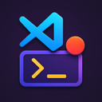

# Command Dock

<div align="center">



**一个强大的 VSCode/Cursor 插件，允许您创建自定义按钮来执行终端命令**

[](package.json)
[](LICENSE)
[](https://www.typescriptlang.org/)
[](https://code.visualstudio.com/)
[](https://pnpm.io/)

[](https://github.com/your-username/vscode-extension-custom-button/actions)
[](https://marketplace.visualstudio.com/items?itemName=seagull.command-dock)
[](https://marketplace.visualstudio.com/items?itemName=seagull.command-dock)

[🚀 安装](#-安装方式) • [📖 使用指南](#使用方法) • [💡 示例](#-实用示例) • [🔧 开发](#开发和构建) • [🤝 贡献](#贡献指南)

</div>

---

## ✨ 功能特性

<table>
<tr>
<td width="50%">

### 🎛️ **核心功能**
- 🎯 **独立面板管理** - 在资源管理器中显示专用的按钮管理面板
- ⚡ **一键执行命令** - 直接在面板中点击按钮执行终端命令
- 🏢 **基于工作区** - 按钮列表根据工作区组织（支持多工作区）
- 🎨 **自定义样式** - 支持自定义按钮图标和颜色

</td>
<td width="50%">

### 🛠️ **管理功能**
- 📝 **便捷管理** - 面板内直接添加、编辑、删除按钮
- 💾 **配置持久化** - 配置保存在工作区设置中
- 🔄 **实时同步** - 状态栏按钮与面板同步显示
- 🌐 **多平台支持** - Windows、macOS、Linux 全平台兼容

</td>
</tr>
</table>

## 🚀 安装方式

### 📦 从 VSCode Marketplace 安装（推荐）

<details>
<summary>点击展开安装步骤</summary>

1. 🖥️ 打开 VSCode/Cursor
2. ⌨️ 按 `Ctrl+Shift+X` (Windows/Linux) 或 `Cmd+Shift+X` (macOS) 打开扩展面板
3. 🔍 搜索 "Command Dock"
4. 📥 点击安装
5. 🔄 重新加载窗口

</details>

### 🔧 本地开发安装

如果您想要参与开发或测试最新功能：

```bash
# 📁 克隆项目
git clone https://github.com/your-username/vscode-extension-custom-button.git
cd vscode-extension-custom-button

# 📦 安装依赖
pnpm install

# 🚀 本地安装扩展
make install-local
# 或者
./scripts/install-local.sh

# 🔄 重新安装（修改代码后）
make reinstall
# 或者
./scripts/install-local.sh --reinstall
```

📚 详细的本地安装指南请查看：[本地安装指南](docs/LOCAL_INSTALL_GUIDE.md)

## 📋 界面说明

### 🎯 主要操作区域

| 区域 | 位置 | 功能 |
|------|------|------|
| 🎛️ **自定义按钮面板** | 资源管理器侧栏 | 显示按钮列表、提供管理操作、支持工作区分组 |
| 📊 **状态栏按钮** | 编辑器底部 | 快速执行常用命令、与面板内容同步 |

## 📖 使用方法

### 🎯 面板操作（推荐）

<details>
<summary>🔍 1. 打开面板</summary>

- 在资源管理器侧栏找到 "🎛️ Command Dock" 面板
- 如果没有显示，确保已打开工作区文件夹

</details>

<details>
<summary>➕ 2. 添加按钮</summary>

- 点击面板标题栏的 ➕ 按钮
- 或右键面板空白区域选择 "Add Button"
- 按提示填写：
  - **📝 按钮名称**（必填）：如 "🚀 Dev Server"
  - **⚡ 执行命令**（必填）：如 "npm run dev"
  - **🎨 图标名称**（可选）：如 "play", "gear", "terminal"
  - **🌈 按钮颜色**（可选）：选择预设颜色

</details>

<details>
<summary>▶️ 3. 使用按钮</summary>

- **方式一**：直接点击面板中的按钮名称
- **方式二**：点击状态栏中的对应按钮
- **方式三**：右键按钮选择 "Execute Command"

</details>

<details>
<summary>⚙️ 4. 管理按钮</summary>

- **✏️ 编辑**：右键按钮 → "Edit Button" 或点击编辑图标
- **🗑️ 删除**：右键按钮 → "Remove Button" 或点击删除图标
- **🔄 刷新**：点击面板标题栏的刷新按钮

</details>

### 🎮 传统命令操作

也可以通过命令面板使用：

| 操作 | 快捷键 | 命令 |
|------|--------|------|
| ➕ **添加按钮** | `Cmd+Shift+P` | `Custom Button: Add Custom Button` |
| ✏️ **编辑按钮** | `Cmd+Shift+P` | `Custom Button: Edit Custom Button` |
| 🗑️ **删除按钮** | `Cmd+Shift+P` | `Custom Button: Remove Custom Button` |

## 💡 实用示例

### 🌐 前端开发工作流

<details>
<summary>⚛️ React/Vue/Angular 项目</summary>

```json
{
  "customButton.buttons": [
    {
      "id": "dev-server",
      "name": "🚀 Dev Server",
      "command": "npm run dev",
      "icon": "play",
      "color": "#00ff00"
    },
    {
      "id": "build-project",
      "name": "🔨 Build",
      "command": "npm run build",
      "icon": "gear",
      "color": "#0000ff"
    },
    {
      "id": "run-tests",
      "name": "🧪 Test",
      "command": "npm test",
      "icon": "beaker",
      "color": "#ffff00"
    },
    {
      "id": "install-deps",
      "name": "📦 Install",
      "command": "npm install",
      "icon": "package",
      "color": "#ffa500"
    }
  ]
}
```

</details>

### 🔄 Git 操作快捷键

<details>
<summary>🌿 基础 Git 工作流</summary>

```json
{
  "customButton.buttons": [
    {
      "id": "git-status",
      "name": "📊 Status",
      "command": "git status",
      "icon": "git-branch"
    },
    {
      "id": "git-pull",
      "name": "⬇️ Pull",
      "command": "git pull",
      "icon": "arrow-down"
    },
    {
      "id": "git-push",
      "name": "⬆️ Push",
      "command": "git push",
      "icon": "arrow-up"
    }
  ]
}
```

</details>

### 🐳 Docker 容器管理

<details>
<summary>🏗️ Docker Compose 工作流</summary>

```json
{
  "customButton.buttons": [
    {
      "id": "docker-up",
      "name": "🐳 Up",
      "command": "docker-compose up -d",
      "icon": "triangle-up",
      "color": "#0000ff"
    },
    {
      "id": "docker-down",
      "name": "🛑 Down",
      "command": "docker-compose down",
      "icon": "triangle-down",
      "color": "#ff0000"
    },
    {
      "id": "docker-logs",
      "name": "📋 Logs",
      "command": "docker-compose logs -f",
      "icon": "output"
    }
  ]
}
```

</details>

📚 更多配置示例请查看：[使用示例文档](docs/EXAMPLES.md)

## 🏗️ 技术架构

插件采用模块化设计，遵循 **SOLID** 原则：

```
📦 Command Dock Architecture
├── 📝 types.ts              # 类型定义
├── ⚙️ configManager.ts      # 配置管理
├── ⚡ commandExecutor.ts    # 命令执行器
├── 🎛️ buttonManager.ts      # 状态栏按钮管理器
├── 📊 panelProvider.ts      # 面板数据提供者
├── 🎮 panelCommands.ts      # 面板命令处理器
├── 🖥️ uiHandler.ts          # 用户界面处理
└── 🚀 extension.ts          # 主入口文件
```

### 🔧 技术栈

<div align="center">


</div>

## 🏢 多工作区支持

| 模式 | 说明 | 功能 |
|------|------|------|
| 📁 **单工作区** | 直接显示按钮列表 | 简洁的按钮管理 |
| 🏢 **多工作区** | 按工作区分组显示 | 每个工作区独立配置 |

## 🔧 开发和构建

### ⚡ 快速开始

```bash
# 🔧 使用 Makefile（推荐）
make help          # 📋 查看所有可用命令
make dev           # 🛠️ 开发模式
make quick         # ⚡ 快速开发周期
make status        # 📊 查看项目状态

# 📦 或使用 pnpm 命令
pnpm install       # 📥 安装依赖
pnpm run compile   # 🔨 编译TypeScript
pnpm run watch     # 👀 监听文件变化
pnpm run lint      # 🔍 代码检查
pnpm run lint:fix  # 🔧 自动修复代码问题
```

### 🔄 开发工作流

1. **📝 修改代码**
2. **🔄 重新安装扩展**：
   ```bash
   make reinstall
   ```
3. **🔄 重新加载 VSCode 窗口**：`Cmd+Shift+P` → "Developer: Reload Window"

### 🚀 发布流程

```bash
# 📈 发布补丁版本
make release-patch

# 🚀 发布次要版本
make release-minor

# 💥 发布主要版本
make release-major

# 🧪 发布预发布版本
make release-pre
```

## 🔍 调试插件

### 🛠️ 方法一：F5 调试（推荐）

1. 🖥️ 在 VSCode/Cursor 中打开项目
2. ⌨️ 按 `F5` 启动调试
3. 🔍 在新的扩展宿主窗口中测试功能

### 📦 方法二：本地安装调试

1. 📝 修改代码
2. 🔄 运行 `make reinstall`
3. 🔄 重新加载 VSCode 窗口

## 📁 项目结构

```
📦 vscode-extension-custom-button/
├── 🤖 .github/workflows/     # GitHub Actions 配置
├── 📜 scripts/              # 构建和发布脚本
│   ├── 📥 install-local.sh  # 本地安装脚本
│   └── 🚀 release.sh        # 发布脚本
├── 📝 src/                  # 源代码
│   ├── 🚀 extension.ts      # 主入口
│   ├── 📋 types.ts          # 类型定义
│   ├── ⚙️ configManager.ts  # 配置管理
│   ├── ⚡ commandExecutor.ts # 命令执行器
│   ├── 🎛️ buttonManager.ts  # 按钮管理器
│   ├── 📊 panelProvider.ts  # 面板提供者
│   ├── 🎮 panelCommands.ts  # 面板命令
│   └── 🖥️ uiHandler.ts      # UI 处理
├── 📚 docs/                 # 文档
├── 🔧 Makefile              # 构建脚本
├── 📋 package.json          # 项目配置
└── 📖 README.md             # 项目说明
```

## 🤝 贡献指南

我们欢迎任何形式的贡献！

### 🚀 快速贡献

1. 🍴 **Fork 项目**
2. 🌿 **创建功能分支**：`git checkout -b feature/amazing-feature`
3. 📝 **提交变更**：`git commit -m 'feat: add amazing feature'`
4. 📤 **推送分支**：`git push origin feature/amazing-feature`
5. 🔀 **创建 Pull Request**

### 📋 贡献类型

| 类型 | 说明 | 标签 |
|------|------|------|
| 🐛 **Bug 修复** | 修复已知问题 | `bug` |
| ✨ **新功能** | 添加新功能 | `enhancement` |
| 📚 **文档改进** | 改进文档 | `documentation` |
| 🎨 **代码优化** | 代码重构和优化 | `refactor` |
| 🧪 **测试** | 添加或改进测试 | `test` |

📖 详细的开发指南请查看：[开发指南](DEVELOPMENT.md)

## 📞 技术支持

<div align="center">

| 类型 | 链接 | 说明 |
|------|------|------|
| 📖 **开发指南** | [DEVELOPMENT.md](DEVELOPMENT.md) | 完整的开发文档 |
| 🔧 **本地安装** | [本地安装指南](docs/LOCAL_INSTALL_GUIDE.md) | 本地开发安装说明 |
| 💡 **使用示例** | [示例文档](docs/EXAMPLES.md) | 丰富的配置示例 |
| 🐛 **问题反馈** | [GitHub Issues](https://github.com/your-username/vscode-extension-custom-button/issues) | 提交 Bug 和功能请求 |
| 💬 **讨论交流** | [GitHub Discussions](https://github.com/your-username/vscode-extension-custom-button/discussions) | 社区讨论 |

</div>

## 🏆 致谢

感谢所有为这个项目做出贡献的开发者！

<div align="center">

[](https://github.com/your-username/vscode-extension-custom-button/graphs/contributors)

</div>

## 📄 许可证

<div align="center">

[](LICENSE)

MIT License - 详见 [LICENSE](LICENSE) 文件

---

<sub>Made with ❤️ by the Command Dock team</sub>

</div> 